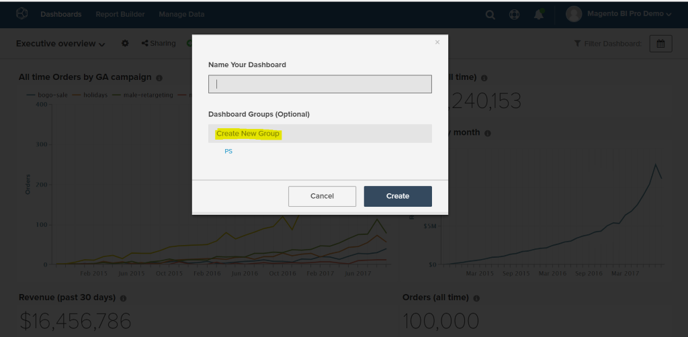
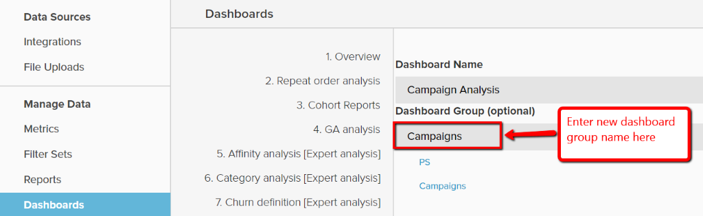

# Usar grupos de tableros

Los grupos de tableros permiten una mejor organización de los tableros. El caso de uso más común es agrupar tableros similares bajo el mismo &quot;grupo&quot;. Por ejemplo, todos los tableros relacionados con el marketing se pueden agrupar en un grupo de tableros &quot;Marketing&quot;.

En la lista desplegable de selección del tablero, los grupos de tableros se muestran en orden alfabético, y todos los tableros de la sección &quot;Ningún grupo&quot; se muestran en último lugar. Los tableros del mismo grupo se muestran juntos y en orden alfabético dentro de cada grupo.

## Uso compartido de grupos de tableros

Los grupos de tableros no se pueden compartir directamente entre los usuarios. Cuando un tablero se comparte con los usuarios, el grupo de tableros en el que se encuentra se crea automáticamente para esos usuarios si aún no existe. Si el grupo de tableros ya existe, el tablero se añade simplemente a la lista.

Cuando el propietario cambia el grupo de un tablero, el cambio se reflejará automáticamente para todos los usuarios con los que se haya compartido el tablero. Los usuarios no pueden cambiar el grupo de tableros de los que no son propietarios.

## Crear grupos de tableros

Los grupos de tableros se pueden crear de una de las dos maneras siguientes:

1. Al crear un tablero nuevo:

   

1. Al cambiar el grupo de un tablero existente, desde el `Manage Data > Dashboards` página:

   1. Haga clic en el tablero para el que desea crear el nuevo grupo.

   1. En `Dashboard Group (optional)`, aparecerá el grupo de tableros actual.

   1. Para crear un grupo nuevo, escriba el nombre del grupo nuevo y haga clic fuera del cuadro.

      

## Agregar tableros existentes a grupos existentes

1. En el `Manage Data > Dashboards` , elija el tablero para el que desea cambiar el grupo.

1. El texto debajo de `Dashboard Group (optional)` muestra el grupo de tableros actual del tablero.

1. Para cambiar el grupo del panel, elija otro grupo de la lista: en este caso `PS`, `Campaigns`.

   

## Eliminar grupos de tableros

Cuando un grupo de tableros no tiene tableros debajo de él, se elimina automáticamente.
