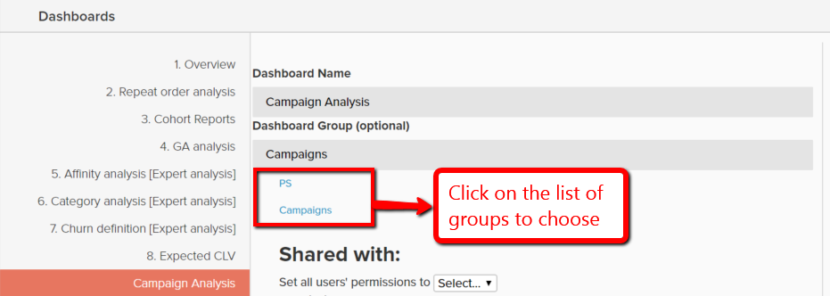

# Usar grupos de tableros

Los grupos de paneles permiten una mejor organización de los paneles. El caso de uso más común es agrupar paneles similares en el mismo &quot;grupo&quot;. Por ejemplo, todos los paneles relacionados con el marketing podrían agruparse en un grupo de paneles llamado &quot;Marketing&quot;.

En el menú desplegable de selección de tableros, los grupos de tableros se muestran en orden alfabético, con todos los tableros debajo de &quot;Sin grupo&quot; en último lugar. Los paneles bajo el mismo grupo se muestran juntos y en orden alfabético dentro de cada grupo.

## Uso compartido de grupos de paneles

Los grupos de paneles no se pueden compartir directamente entre los usuarios. Cuando se comparte un panel con los usuarios, el grupo de paneles en el que se encuentra se crea automáticamente para esos usuarios si no existe. Si existe el grupo de tableros, el tablero se anexará a la lista.

Cuando el propietario cambia el grupo de un panel, el cambio se refleja automáticamente en todos los usuarios con los que se ha compartido el panel. Los usuarios no pueden cambiar el grupo de paneles de paneles de los que no son propietarios.

## Crear grupos de tableros

Los grupos de paneles se pueden crear de una de las dos maneras siguientes:

1. Al crear un tablero:

   

1. Al cambiar el grupo de un tablero existente, desde la página `Manage Data > Dashboards`:

   1. Haga clic en el tablero para el que desea crear el grupo.

   1. En `Dashboard Group (optional)`, aparece el grupo de tableros actual.

   1. Para crear un grupo, escriba el nombre del nuevo grupo y haga clic fuera del cuadro.

      

## Añadir tableros existentes a grupos existentes

1. En la página `Manage Data > Dashboards`, elija el tablero para el cual desea cambiar el grupo.

1. El texto bajo `Dashboard Group (optional)` muestra el grupo de tableros actual del tablero.

1. Para cambiar el grupo del tablero, elija otro grupo de la lista, en este caso `PS`, `Campaigns`.

   

## Eliminar grupos de tableros

Cuando un grupo de paneles no tiene paneles debajo, se elimina automáticamente.
