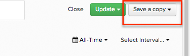

# Creación de una copia de un informe

A menudo, desea crear gráficos definidos de forma similar en los que solo desea cambiar un elemento, como editar un filtro o cambiar `group by`.

En estos casos, inicie `Chart Editor` y haga clic en **[!UICONTROL Save As]** en la esquina superior derecha. Esto replica el gráfico existente y lo agrega al panel actual con el nuevo nombre que seleccione, y le permite editar la configuración del nuevo gráfico de inmediato.

