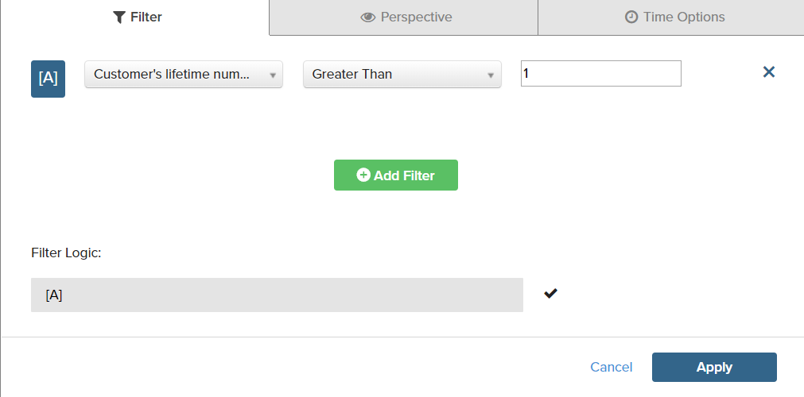

# Filtros

Se pueden añadir uno o más filtros para limitar los datos que se utilizan para generar un informe. Cada filtro es una expresión que incluye una columna de la tabla asociada, un operador y un valor. Por ejemplo, para incluir solo clientes repetidos, puede crear un filtro que incluya solo clientes que hayan realizado más de un pedido. Se pueden utilizar varios filtros con `AND/OR` para añadir lógica al informe.

>[!TIP]
>
>Un informe puede tener un máximo de 3500 puntos de datos. Para reducir el número de puntos de datos, utilice un filtro para reducir la cantidad de datos que se utilizan para generar el informe.

[!DNL Adobe Commerce Intelligence] incluye una selección de filtros que puede utilizar &quot;listos para usar (OOTB)&quot; o modificar para adaptarlos a sus necesidades. No hay límite en el número de filtros que se pueden crear.

## Para añadir un filtro:

1. En el gráfico, pase el ratón sobre cada punto de datos.

   En este informe, cada punto de datos muestra la cantidad total de clientes durante el mes.

1. En el panel izquierdo, haga clic en el botón Filtros () icono.

   

1. Clic **[!UICONTROL Add Filter]**.

   Los filtros se numeran alfabéticamente y el primero es `[A]`. Las dos primeras partes del filtro son opciones desplegables y la tercera parte es un valor.

   

   * Haga clic en la primera parte del filtro y elija la columna que desea utilizar como asunto de la expresión.

     

   * Haga clic en la segunda parte del filtro y seleccione el operador.

     

   * En la tercera parte del filtro, introduzca el valor necesario para completar la expresión.

     

   * Cuando haya completado el filtro, haga clic en **[!UICONTROL Apply]**.

     Ahora, el informe solo incluye clientes que repiten y el número de registros de clientes recuperados para el informe se ha reducido de 33 000 a 12 600.

     <!--{: .zoom}-->

1. En la barra lateral, haga clic en la perspectiva ( ) icono.

   <!--{: .zoom}-->

1. En la lista de configuraciones, elija `Cumulative`. A continuación, haga clic en **[!UICONTROL Apply]**.

   

   El `Cumulative` La perspectiva distribuye el cambio con el tiempo, en lugar de mostrar los desgloses y ascendentes escalonados de cada mes.

1. Introduzca una `Title` para el informe y haga clic en **[!UICONTROL Save]** it as a `Chart` a su tablero.

   
