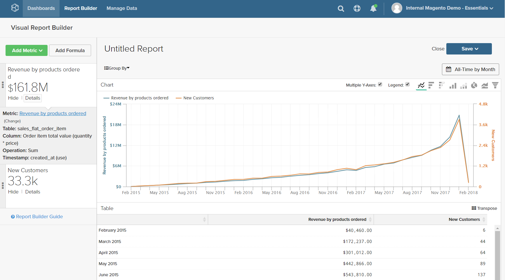
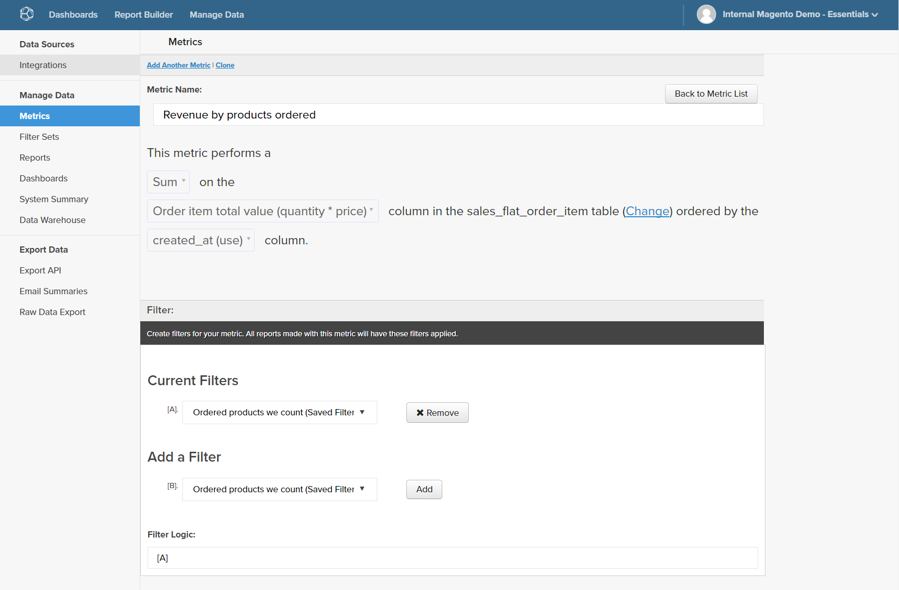

# Fórmulas

Una fórmula combina varias métricas y lógica matemática para responder a una pregunta. Por ejemplo, ¿qué parte de los ingresos por producto durante la temporada de vacaciones los generaron los nuevos clientes?

## Paso 1: Crear el informe básico

1. En el menú, elija `Report Builder`.

1. Haga clic en **[!UICONTROL Add Metric]** y elija la primera métrica para el informe.

   Para este ejemplo, se utiliza la métrica `Revenue by products ordered`.

1. Vuelva a hacer clic en **[!UICONTROL Add Metric]** y elija la segunda métrica para el informe.

   Para este ejemplo, se utiliza la métrica `New Customers`.

1. En la barra lateral, haga clic en **[!UICONTROL Details]** para mostrar información sobre cada métrica.

   

1. En la barra lateral, haga clic en el nombre de cada métrica para abrir la página de configuración en una nueva pestaña del explorador. Desplácese hacia abajo para ver cada componente de la métrica, incluidas la consulta de métrica, el filtro y las dimensiones.

   

1. Para volver al informe, haga clic en la pestaña del explorador anterior.

1. En el gráfico, pase el ratón sobre unos pocos puntos de datos de cada línea para ver las cantidades asociadas a cada métrica.

## Paso 2: Añadir una fórmula

1. En la parte superior de la barra lateral, haga clic en **[!UICONTROL Add Formula]**.

   El cuadro de fórmula muestra las métricas como entradas disponibles `A` y `B`, e incluye un cuadro de entrada en el que puede escribir la fórmula.

   Haga lo siguiente:

   * En el cuadro de entrada `Enter your Formula`, escriba `A/B`.

     Esto divide los ingresos por productos ordenados por el número de clientes nuevos.

   * Establezca `Select format` en `123Number`.

   * En la barra lateral, reemplace `Untitled` por un nombre para la fórmula.

   

1. Una vez finalizado, haga clic en **[!UICONTROL Apply]**.

   El informe ahora tiene una nueva línea para la fórmula `New Customer Revenue`, y la barra lateral muestra la cantidad total de ingresos generados por los nuevos clientes.

   

## Paso 3: Añadir un intervalo de fechas

1. Haga clic en **[!UICONTROL Date Range]** en la esquina superior derecha.

1. En la ficha `Fixed Date Range`, haga lo siguiente:

   * En los calendarios, elija el intervalo de fechas.

     Para este ejemplo, la temporada de vacaciones es de `November 1` a `December 31`.

   * En `Select Time Interval`, elija `Day`.

     

   * Una vez finalizado, haga clic en **[!UICONTROL Apply]**.

   El informe ahora se limita a la temporada de vacaciones, con un punto de datos para cada día.

   

## Paso 4: Guardar el informe

En este paso, guarda el informe como un gráfico y también como una tabla.

1. Haga clic en `Untitled Report` en la parte superior de la página e introduzca un título descriptivo. Para este ejemplo, el título del informe es `2017 Holiday Sales`.

   A continuación, haga lo siguiente:

   * En la esquina superior derecha, haga clic en **[!UICONTROL Save]**.

   * Para `Type`, acepte la configuración predeterminada `Chart`.

   * Elija el `Dashboard` en el que el informe va a estar disponible.

   * Haga clic en **[!UICONTROL Save to Dashboard]**.

1. Haga clic en el título del informe y cambie el nombre. Para este ejemplo, el título del informe se cambia a `2017 Holiday Sales Data`.

   A continuación, haga lo siguiente:

   * En la esquina superior derecha, haga clic en **[!UICONTROL Save a Copy]**.

   * Establezca `Type` en `Table`.

   * Elija el `Dashboard` en el que el informe va a estar disponible.

   * Haga clic en **[!UICONTROL Save a Copy to Dashboard]**.

1. Para ver los informes en el panel, siga uno de estos procedimientos:

   * Haga clic en **[!UICONTROL Go to Dashboard]** en el mensaje en la parte superior de la página.

   * En el menú, elija **[!UICONTROL Dashboards]**. Haga clic en el nombre del tablero actual para mostrar la lista. A continuación, haga clic en el nombre del tablero en el que se guardó el informe.
