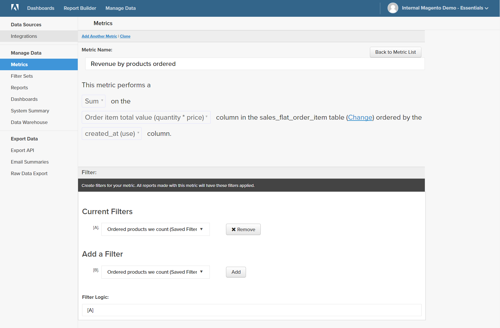

# Fórmulas

Una fórmula combina varias métricas y lógica matemática para responder a una pregunta. Por ejemplo, ¿cuántos ingresos por producto durante la temporada de vacaciones los generaron los nuevos clientes?

## Paso 1: Crear el informe básico

1. En el menú , elija `Report Builder`.

1. Haga clic en **[!UICONTROL Add Metric]** y elija la primera métrica del informe.

   Para este ejemplo, la variable `Revenue by products ordered` se utiliza.

1. Haga clic en **[!UICONTROL Add Metric]** y elija la segunda métrica del informe.

   Para este ejemplo, la variable `New Customers` se utiliza.

1. En la barra lateral, haga clic en **[!UICONTROL Details]** para mostrar información sobre cada métrica.

   

1. En la barra lateral, haga clic en el nombre de cada métrica para abrir la página de configuración en una nueva ficha del explorador. Desplácese hacia abajo para ver cada componente de la métrica, incluida la consulta de métrica, el filtro y las dimensiones.

   

1. Para volver al informe, haga clic en la pestaña del explorador anterior.

1. En el gráfico, pase el ratón sobre unos pocos puntos de datos en cada línea para ver las cantidades asociadas a cada métrica.

## Paso 2: Agregar una fórmula

1. En la parte superior de la barra lateral, haga clic en **[!UICONTROL Add Formula]**.

   El cuadro de fórmula muestra las métricas como entradas disponibles `A` y `B`, e incluye un cuadro de entrada en el que puede introducir la fórmula.

   Haga lo siguiente:

   * En el `Enter your Formul` cuadro de entrada, introduzca `A/B`.

      Esto dividirá los ingresos por productos solicitados por el número de clientes nuevos.

   * Establezca `Select format` a `123Number`.

   * En la barra lateral, sustituya `Untitled` con un nombre para la fórmula.

   

1. Cuando termine, haga clic en **[!UICONTROL Apply]**.

   El informe ahora tiene una nueva línea para la fórmula, `New Customer Revenue`y la barra lateral muestra la cantidad total de ingresos generados por los nuevos clientes.

   

## Paso 3: Agregar un intervalo de fechas

1. Haga clic en **[!UICONTROL Date Range]** en la esquina superior derecha.

1. En el `Fixed Date Range` , haga lo siguiente:

   * En los calendarios, elija el intervalo de fechas.

      Para este ejemplo, la temporada de vacaciones es del 1 de noviembre al 31 de diciembre.

   * En `Select Time Interval`, elija `Day`.

      

   * Cuando termine, haga clic en **[!UICONTROL Apply]**.

   El informe ahora está limitado a la temporada de vacaciones, con un punto de datos para cada día.

   

## Paso 4: Guardar el informe

En este paso, el informe se guarda como un gráfico y también como una tabla.

1. Haga clic en `Untitled Report` en la parte superior de la página e introduzca un título descriptivo. Para este ejemplo, el título del informe es `2017 Holiday Sales`.

   A continuación, haga lo siguiente:

   * En la esquina superior derecha, haga clic en **[!UICONTROL Save]**.

   * Para `Type`, acepte el valor predeterminado `Chart` configuración.

   * Elija la `Dashboard` donde el informe debe estar disponible.

   * Haga clic en **[!UICONTROL Save to Dashboard]**.

1. Haga clic en el título del informe y cambie el nombre. Para este ejemplo, el título del informe cambia a `2017 Holiday Sales Data`.

   A continuación, haga lo siguiente:

   * En la esquina superior derecha, haga clic en **[!UICONTROL Save a Copy]**.

   * Establezca `Type` a `Table`.

   * Elija la `Dashboard` donde el informe debe estar disponible.

   * Haga clic en **[!UICONTROL Save a Copy to Dashboard]**.

1. Para ver los informes en el tablero, realice una de las siguientes acciones:

   * Haga clic en **[!UICONTROL Go to Dashboard]** en el mensaje de la parte superior de la página.

   * En el menú , elija **[!UICONTROL Dashboards]**. Haga clic en el nombre del tablero actual para mostrar la lista. A continuación, haga clic en el nombre del tablero donde se guardó el informe.
