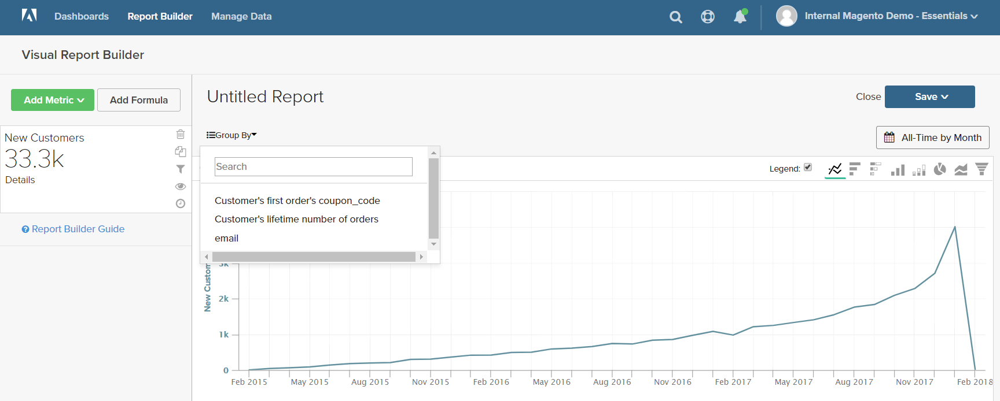
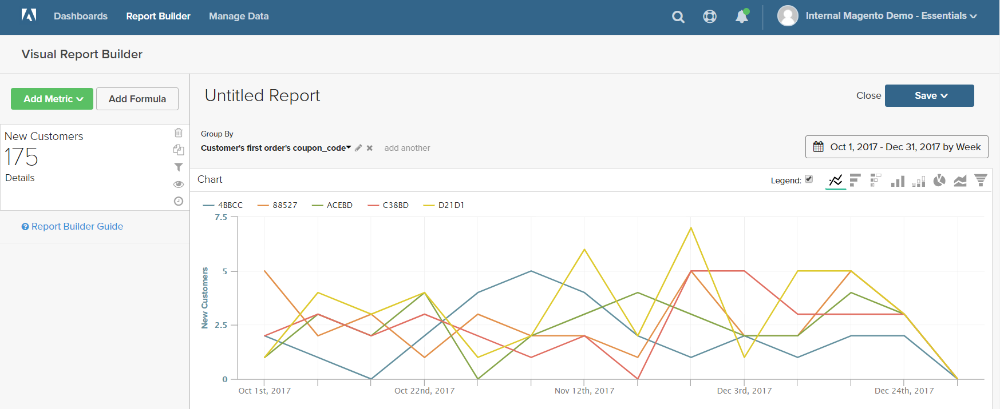

# `Visual Report Builder`

`Visual Report Builder` facilita la creación de informes rápidos basados en métricas predefinidas. Cada métrica incluye una consulta que define el conjunto de datos para el informe.

En el siguiente ejemplo se muestra cómo crear un informe simple, agrupar los datos por una dimensión adicional, configurar el intervalo de fecha y hora, cambiar el tipo de gráfico y guardar el informe en un tablero.

## Para crear un informe simple:

1. En el [!DNL MBI] , haga clic en **[!UICONTROL Report Builder]**.

1. En `Visual Report Builder`, haga clic en **[!UICONTROL Create Report]** y haga lo siguiente:

   * Haga clic en **[!UICONTROL Add Metric]**.

      Las métricas disponibles pueden enumerarse alfabéticamente o por tabla.

      

   * Elija la [métrica](../../data-user/reports/ess-manage-data-metrics.md) que describe el conjunto de datos que desea utilizar para el informe.

      La variable `New Customers` La métrica utilizada en este ejemplo cuenta todos los clientes y ordena la lista por la fecha en la que el cliente se registró en una cuenta. El informe inicial incluye un gráfico de líneas sencillo, seguido de una tabla de datos.

      El resumen de la izquierda muestra el nombre de la métrica actual, seguido del resultado de cualquier cálculo de datos de columna que se especifique en la métrica. En este ejemplo, el resumen muestra el recuento total de clientes.

      

1. En el gráfico, pase el ratón sobre cada punto de datos de la línea. Cada punto de datos muestra la cantidad total de clientes nuevos que se registraron durante ese mes.

1. Siga estas instrucciones para agrupar los datos, cambiar el intervalo de fechas y el tipo de gráfico.

   **`Group By`**

   La variable `Group By` permite agregar varias dimensiones por grupo o segmento. Los Dimension son columnas de la tabla que se pueden utilizar para agrupar los datos.

   * Elija una de las dimensiones disponibles de la lista de `Group By` opciones.

      Para este ejemplo, el sistema encontró cinco códigos de cupones que utilizaban los clientes al realizar su primer pedido.

      

      La variable `Group By` detail enumera cada cupón que utilizan los clientes. Los cupones utilizados para realizar el orden inicial se marcan con una casilla de verificación. El gráfico ahora tiene varias líneas de color que representan cada cupón que se utilizó para un primer pedido. El pie de ilustración tiene un código de colores que corresponde a cada fila de datos.

   * Haga clic en **[!UICONTROL Apply]** para cerrar el grupo por detalle.

      

   * Pase el ratón sobre algunos puntos de datos en cada línea para ver el número de clientes durante el mes que usaron ese cupón mientras realizaban su primer pedido.

   * La tabla de datos ahora tiene una dimensión adicional, con una columna para cada mes y una fila para cada código de cupón.

      

   * Haga clic en Transponer () en la esquina superior derecha de la tabla para cambiar la orientación de los datos.

      El eje de los datos cambia y la tabla ahora tiene una columna para cada código de cupón y una fila para cada mes. Puede que le resulte más fácil leer esta orientación.

      
   **`Date Range`**

   La variable `Date Range` muestra la configuración actual del intervalo de fecha y tiempo y se encuentra justo encima del gráfico a la derecha.

   * Haga clic en el `Date Range` control, que en este ejemplo se establece como `All-Time by Month`.

      

   * Realice los siguientes cambios:

      * Para acercar una vista más cercana, cambie el intervalo de fechas a `Last Full Quarter`.
      * En `Select Time Interval`, elija `Week`.
      * Cuando termine, haga clic en **[!UICONTROL Save]**.

      El informe ahora incluye solamente los datos del último trimestre, por semana.

      
   **Tipo de gráfico**

   * Haga clic en los controles de la esquina superior derecha para encontrar el mejor gráfico para los datos.

      Algunos tipos de gráficos no son compatibles con los datos multidimensionales.

      |  |  |
      |-----|-----|
      |  | Gráfico de líneas |
      |  | Barra horizontal |
      |  | Barra apilada horizontal |
      |  | Barra vertical |
      |  | Barra apilada vertical |
      |  | Circular |
      |  | Área |
      |  | Embudo |

      {style=&quot;table-layout:auto&quot;}

1. Para dar al informe un `title`, reemplace el `Untitled Report` texto en la parte superior de la página con un título descriptivo.

1. En la esquina superior derecha, haga clic en **[!UICONTROL Save]** y haga lo siguiente:

   * Para `Type`, acepte la configuración predeterminada, `Chart`.

   * Elija la `Dashboard` donde el informe debe estar disponible.

   * Haga clic en **[!UICONTROL Save to Dashboard]**.

      

1. Para ver el gráfico en un tablero, realice una de las acciones siguientes:

   * Haga clic en **[!UICONTROL Go to Dashboard]** en el mensaje de la parte superior de la página.

   * En el menú , elija `Dashboards` y haga clic en el nombre del tablero actual para mostrar la lista. A continuación, haga clic en el nombre del tablero donde se guardó el informe.

      
