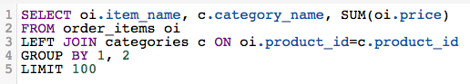

# Elegir un creador de informes

>[!NOTE]
>>Requiere [Permisos de administrador](../../administrator/user-management/user-management.md).

A todos nos gusta tener opciones. Pero, cuando nos enfrentamos a opciones, algunos de nosotros podríamos negarnos y congelarnos ante la idea de tener que comprometernos con una decisión. Las opciones son buenas, pero también pueden ser abrumadoras y confusas.

Ahora que tiene más opciones para crear análisis, a veces puede resultar difícil saber exactamente qué sabor del Creador de informes se adaptará a sus necesidades. Si necesita alguna guía para elegir la mejor manera de crear su análisis, este artículo es para usted.

## ¿Cuándo debo usar la variable `SQL Report Builder`? {#whensql}

Eche un vistazo a algunas de las razones más comunes por las que usaría el Report Builder SQL sobre el Report Builder tradicional.

### Si desea utilizar funciones específicas de SQL...

Parte de la belleza del `SQL Report Builder` es que le permite utilizar funciones que actualmente no están disponibles en el Administrador de Datas Warehouse. En el pasado, un analista puede haber tenido que intervenir para ayudarle a realizar plenamente su visión.

El Report Builder SQL admite funciones como [`LISTAGG`](https://docs.aws.amazon.com/redshift/latest/dg/r_LISTAGG.html) y [`GETDATE`](https://docs.aws.amazon.com/redshift/latest/dg/r_GETDATE.html), que no se podía usar previamente. Puede acceder al [`full list`](https://docs.aws.amazon.com/redshift/latest/dg/c_SQL_functions.html), pero algunas otras funciones específicas de SQL incluyen:

* [`Bitwise aggregate` funciones](https://docs.aws.amazon.com/redshift/latest/dg/c_bitwise_aggregate_functions.html)
* [`CASE expression`](https://docs.aws.amazon.com/redshift/latest/dg/r_CASE_function.html)
* [`JSON_EXTRACT_PATH_TEXT`](https://docs.aws.amazon.com/redshift/latest/dg/JSON_EXTRACT_PATH_TEXT.html)
* [`LOG`](https://docs.aws.amazon.com/redshift/latest/dg/r_LOG.html)
* [`MONTHS_BETWEEN`](https://docs.aws.amazon.com/redshift/latest/dg/r_MONTHS_BETWEEN_function.html)
* [`REPLACE`](https://docs.aws.amazon.com/redshift/latest/dg/r_REPLACE.html)
* [`SQRT`](https://docs.aws.amazon.com/redshift/latest/dg/r_SQRT.html)
* [`concatenation` operador](https://docs.aws.amazon.com/redshift/latest/dg/r_concat_op.html)

### Si desea realizar algunas pruebas...

Si desea probar distintas técnicas y estrategias para averiguar qué es lo que mejor funciona para el análisis, puede que desee usar la variable `SQL Report Builder`. La creación de columnas en el Administrador de Datas Warehouse lleva tiempo y las columnas que se crean con el DWM dependen de los ciclos de actualización.

En el mejor de los casos, debe esperar un ciclo de actualización para poder usar la columna. Si te das cuenta de que cometiste un error al crear la columna, tendrás que esperar *two* ciclos: una para rellenar inicialmente la columna y otra para propagar las revisiones.

### Si solo va a usar una nueva columna una vez...

Como hemos mencionado en la sección anterior, la creación de una nueva columna en el Administrador de Datas Warehouse lleva tiempo. Si solo planea utilizar una columna que cree en un informe, sugerimos usar la variable `SQL Report Builder`. Esto eliminará la necesidad de esperar a que se complete un ciclo de actualización, lo que le permitirá volver a trabajar más rápido.

### Si está trabajando con datos que tienen una relación &quot;uno a varios&quot;...

En algunos casos, la estructura de los datos puede hacer que la variable `SQL Report Builder` una opción más lógica y eficaz para crear su análisis. La creación de columnas para relaciones uno a uno es bastante sencilla en el Administrador de Datas Warehouse, pero las cosas pueden resultar un poco confusas cuando se trata de relaciones uno a varios.

Digamos que un solo producto se considera una parte de varias categorías de productos y le gustaría ver los ingresos asociados con cada categoría de cada producto. Intentar crear esta relación utilizando el DWM puede ser tedioso y difícil, pero escribir una consulta SQL puede ser un poco más directo:

## ¿Cuándo debo usar el Report Builder tradicional? {#whentraditionalrb}

Mientras que la variable `SQL Report Builder` le proporciona más control y acceso a funcionalidades que antes no estaban disponibles, puede que no siempre sea la opción correcta. Le sugerimos que tenga en cuenta lo siguiente a la hora de decidir qué tipo de creador de informes utilizar.

### Si está creando un informe simple...

Si lo que desea crear es sencillo, el uso del Report Builder tradicional puede ser mucho más rápido que la escritura de una consulta SQL completa. También ayudará si alguna columna que necesite crear el análisis ya está en el Administrador de Datas Warehouse.

### Si va a compartir su trabajo con otros usuarios...

¿Los usuarios de su organización utilizarán/verán este análisis? Dependiendo de con quién comparta su trabajo, en algunos casos es posible que sea mejor mantenerse en contacto con el Report Builder visual. Los usuarios pueden ver rápidamente la definición en el Report Builder visual en lugar de leer una consulta SQL potencialmente larga.

Si hay algunas personas que necesitan el informe pero no están familiarizadas con SQL, recomendamos utilizar el sabor original del Report Builder. Hará las cosas más fáciles.

## Ajuste {#wrapup}

Ambas `SQL Report Builder` y `Visual Report Builder` son adecuados para una amplia variedad de casos de uso. Esto suele depender de cuáles sean sus necesidades analíticas y quién consumirá el análisis.
