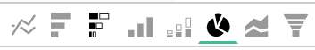
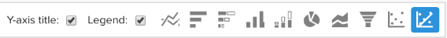

# Opciones de visualización

La selección de la visualización adecuada para un conjunto de datos determinado es una parte fundamental del proceso analítico. Cada conjunto de datos tiene una historia que contar, pero el efecto de esa historia se enfatiza por su impacto visual y legibilidad.

El [!DNL Commerce Intelligence] [!DNL Visual Report Builder] ofrece 12 opciones de visualización distintas, cada una con sus propias ventajas y casos de uso. En este tema se describen las distintas opciones de visualización de [!DNL Commerce Intelligence], incluidas las configuraciones de informe requeridas cuando corresponda, y un ejemplo de un caso de uso. Las siguientes visualizaciones están disponibles en [!DNL Commerce Intelligence]:

* `Scalar`
* `Table`
* `Line`
* `Bar`
* `Stacked Bar`
* `Column`
* `Stacked Column`
* `Pie`
* `Area`
* `Funnel`
* `Scatter plot`
* `Bubble`
* `Heatmap`

## `Scalar`

`Scalar` los informes se muestran como un solo valor numérico. Normalmente, se utiliza para mostrar el valor &quot;todo el tiempo&quot; de una métrica clave como ingresos o pedidos, o para comparar los ingresos hasta la fecha con el presupuesto con dos informes escalares independientes. En el siguiente ejemplo, esto simplemente muestra el número total de pedidos para el intervalo de informes determinado:

Para guardar un informe como un escalar, configure los filtros y la hora y haga clic en **[!UICONTROL Save]** o **[!UICONTROL Update]** en la sección superior derecha del informe. En el `Type` , elija el Nombre de la métrica: Número para guardar el informe como el valor mostrado en la barra lateral izquierda.

**Requisitos**:

* `Time interval`: `None`
* `Group by`: `None`
* Solo una métrica

## `Table`

Como su nombre sugiere, `table` los informes son ideales para mostrar detalles en forma de tabla. Cuando es necesario mostrar muchos grupos por valores o métricas en un solo informe, la mejor manera de hacerlo suele ser mediante una tabla. Por ejemplo, a continuación se muestra una tabla de &quot;Detalles del cliente&quot;, que muestra los pedidos y los ingresos agrupados por correo electrónico del cliente:

De forma similar a los informes escalares, puede guardar un informe como una tabla haciendo clic en **[!UICONTROL Save]** o **[!UICONTROL Update]** en Report Builder, a continuación, seleccione la opción Tabla en `Type` desplegable.

**Requisitos:**

* Aunque no hay requisitos de configuración de informes, es importante tener en cuenta que las tablas están limitadas a 3500 filas. Si el conjunto de datos incluye más de 3500 filas, debe filtrar los resultados para reducir el ámbito o exportar los resultados a `.csv` o `Excel` para ver el conjunto de datos completo.

## `Line`

`Line` los gráficos son la opción perfecta para comparar el rendimiento de cohortes de métricas similares. Por ejemplo, analizando los ingresos de dos regiones en el mismo período de tiempo o comparando el crecimiento interanual de los pedidos satisfechos, como se muestra a continuación:

Cada métrica y fórmula agregada al informe se representa mediante su propia línea. Cuando compare métricas con unidades y escalas similares, no olvide desactivar la casilla de verificación de `Multiple Y-Axes` para mostrar todas las métricas en la misma escala.

Para guardar un informe como un gráfico de líneas, ajústelo `Type` hasta `Chart`y seleccione la visualización adecuada desde el Report Builder, como se muestra a continuación:

**Requisitos:**

* Ninguno

## `Bar`

`Bar` los gráficos muestran los datos como una serie de barras horizontales y son mejores para mostrar el rendimiento general de un número limitado de métricas o agrupar por valores. Por ejemplo, se podría utilizar un gráfico de barras para comparar los ingresos por tienda:

Cada combinación de métrica, grupo por e intervalo de tiempo se muestra como su propia barra. Si tiene dos métricas con una `group by`, que contiene tres `group by` valores, el informe muestra seis barras independientes.

Para guardar un informe como gráfico de barras, ajústelo `Type` hasta `Chart` y seleccione la `Bar` como se muestra a continuación:

**Requisitos:**

* Ninguno

## `Stacked Bar`

`Stacked bar` los gráficos son similares a sus hermanos de gráfico de barras, con la capacidad adicional de mostrar el desglose proporcional de cada barra. Con frecuencia, los gráficos de barras apiladas se configuran con dos o más métricas y un solo grupo por, de modo que cada barra representa un grupo único por valor que se divide entre sus componentes de métrica.

Por ejemplo, el informe siguiente tiene dos métricas de ingresos idénticas: una filtrada para los pedidos por primera vez y otra filtrada para los pedidos repetidos. Después de agrupar por tienda, puede ver la contribución de ingresos total de cada tienda (representada por la anchura total de la barra) y el desglose de ingresos por primera vez, frente a los que se repiten para cada tienda.

Asegúrese de que la `Multiple Y-Axes` La casilla no está marcada al configurar un informe como el anterior.

Para guardar un informe como gráfico de barras apiladas, ajústelo `Type` hasta `Chart` y seleccione la opción barra apilada de report builder:

**Requisitos:**

* Ninguno

## `Column`

`Column` los gráficos representan cada punto de datos como una columna vertical y son mejores para mostrar datos de tendencias temporales que la visualización de gráficos de barras horizontales. Cada métrica única y grupo por combinación se representa en su propia serie de barras. Un informe de columna es mejor para los informes con tres métricas o menos, o una métrica con un solo grupo, ya que contiene entre 1 y 3 grupos por valores.

En el ejemplo siguiente, verá dos métricas de ingresos, una filtrada para los ingresos por primera vez y otra para los ingresos repetidos, con tendencias en el tiempo por mes:

Los informes de columna se pueden guardar cambiando el informe `Type` hasta `Chart`y seleccionando la opción de visualización de columna:

**Requisitos:**

* Ninguno

## `Stacked Column`

`Stacked column` los informes son casi idénticos a los gráficos de columnas, excepto por el hecho de que columnas similares se apilan unas encima de otras, de modo que el alto total representa la suma de los valores. Las columnas apiladas vuelven a visualizarse mejor con un número limitado de métricas o bytes de grupo.

Usar la misma configuración de informe que se describe en la `Column` En la sección anterior, un informe con dos métricas de ingresos (filtradas por primera vez y repetidas) se parecería al siguiente con una visualización de columna apilada:

Una vez más, es importante que la `Multiple Y-Axes` La casilla de verificación se desactiva al mostrar varias métricas con la visualización de columnas apiladas.

Para guardar un informe como una columna apilada, establezca el informe `Type` hasta `Chart` y seleccione la `stacked column` opción:

**Requisitos:**

* Ninguno

## `Pie`

`Pie` los gráficos son mejores para mostrar una sola métrica con uno o más bytes de grupo o varias métricas sin bytes de grupo. En cualquier caso, el intervalo de tiempo debe establecerse en none para mostrar los datos en un gráfico circular. En el ejemplo siguiente, una métrica de pedidos única se agrupa por nombre de tienda para mostrar el desglose de pedidos por tienda:

Para guardar un informe como un gráfico circular, establezca el informe `Type` hasta `Chart` y seleccione la `pie` como se muestra a continuación:

**Requisitos:**

* `Time interval`: `None`
* Cualquiera de las siguientes opciones:
   * `Single metric with one or more group bys`
   * `Multiple metrics with no group bys`

## `Area`

`Area` los gráficos son casi idénticos a los gráficos de columnas apiladas, excepto que las columnas se muestran continuamente. De forma similar a las columnas apiladas, los gráficos de área se visualizan mejor con un número limitado de bytes de grupo o métricas.

Tomando el mismo ejemplo de la `stacked column` , el informe siguiente muestra los ingresos por primera vez en comparación con los ingresos repetidos con la visualización del gráfico de áreas:

Para guardar un informe como un gráfico de áreas, ajuste el `Type` hasta `Chart` y seleccione la opción de área:

**Requisitos:**

* Ninguno

## `Funnel`

`Funnel` los gráficos son perfectos para visualizar la conversión en una secuencia de eventos esperada. Algunos ejemplos son el análisis de los ingresos potenciales del canal de ventas desde el cliente potencial hasta el acuerdo cerrado, o la medición de la caída de clientes entre su primer y segundo pedido, el segundo y tercer pedido, etc. A continuación se muestra un ejemplo de esto último:

En un informe de canal, el valor relativo de un paso determinado del canal se refleja en la altura del paso. La configuración del informe determina el orden en que se muestran los pasos. Existen dos formas de configurar un informe de canal:

* `Single metric with one group by`: orden de los pasos determinado por la configuración &quot;Mostrar superior/inferior&quot; del grupo por. De forma predeterminada, los pasos del canal se muestran en orden del valor más grande al más pequeño, pero también puede ordenarlos alfabéticamente por el grupo por nombre.

* `Multiple metrics with no group by`: orden de los pasos determinado por el orden en que se añaden las métricas al informe.

Para guardar un informe como un gráfico de embudo, ajuste el informe `Type` hasta `Chart` y seleccione la visualización adecuada desde Report Builder.

**Requisitos:**

* `Time interval`: `None`
* Cualquiera de las siguientes opciones:
   * `Single metric with one group by`
   * `Multiple metrics with no group by`

## `Scatter plot`

A `scatter plot` se utiliza para examinar la relación de una métrica con dos variables diferentes, de modo que se puedan identificar fácilmente correlaciones y periféricos. Este tipo de visualización solo se utiliza mejor con dimensiones numéricas: pruébelo con la métrica Pedidos y la variable `Customer's lifetime number of coupons` y `Customer's lifetime revenue` dimensiones para ver cómo el uso de cupones está relacionado con los ingresos. Puede elegir entre un diagrama de puntos con y sin línea de tendencia:

**Requisitos:**

Opción 1:

* Dos `metrics`
* Uno `group by`
* `Time interval`: `None`

Opción 2:

* Dos `metrics`
* No `group by`
* Establecer `time interval`

## `Bubble` gráfico

A `bubble` El gráfico puede mostrar hasta cuatro dimensiones de datos en las que la variable `X` y `Y` Los ejes especifican la ubicación de las burbujas. El `Z` El eje es el tamaño de las burbujas y, al incluir dos grupos de burbujas, puede añadir color a las burbujas. Este tipo de visualización se utiliza mejor cuando desea trazar varias dimensiones de datos en un solo gráfico.

Por ejemplo, el siguiente gráfico muestra el número de clientes (tamaño de burbuja) agrupados por una fuente de adquisición específica (color de burbuja) y el estado (varias burbujas en color específico), trazados frente a los ingresos totales y los pedidos promedio de duración.

El siguiente gráfico muestra el número de clientes (tamaño de burbuja) agrupados por fuente de adquisición (color de burbuja) y estado (varias burbujas en color específico), trazados con el valor de duración promedio y los ingresos totales.

**Requisitos para el gráfico de burbujas de una sola serie:**

Opción 1

* Tres `metrics`
* Uno `group by`
* `Time interval`: `None`

Opción 2

* Tres `metrics`
* No `group by`
* Establecer `time interval`

**Requisitos para el gráfico de burbujas multiserie:**

* Tres `metrics`
* Dos `group by`
* `Time interval`: `None`

## `Heatmap`

Uso `heatmaps` para visualizar puntos interactivos en los datos. Por ejemplo, un mapa de calor puede indicar dónde se obtiene normalmente un volumen mayor. La visualización de estos datos puede ayudarle a ajustar los niveles de inventario para asegurarse de que se ajusta a la demanda durante esos períodos de mayor actividad.

El siguiente mapa de calor muestra los pedidos por día de la semana por hora del día en conjunto, durante varias semanas.

<!--{: width="650"}-->

**Requisitos:**

Opción 1

* Uno `metric`
* Dos `group by`
* `Time interval`: `None`

Opción 2

* Uno `metric`
* Uno `group by`
* Establecer `time interval`
