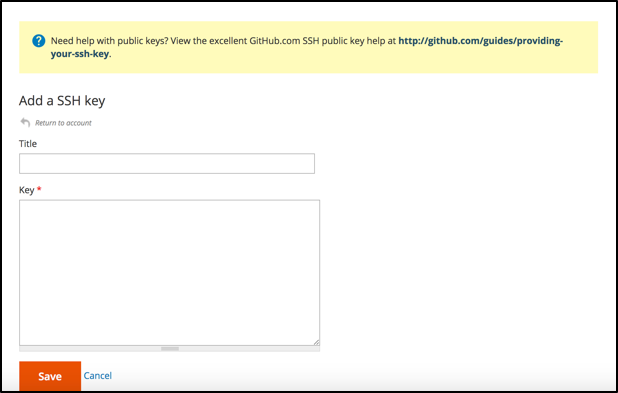

# Active su [!DNL MBI] Cuenta para `Cloud Starter` Suscripciones

Para activar [!DNL MBI] para `Cloud Starter` proyectos, cree primero un [!DNL MBI] y, a continuación, cree una `SSH` , luego conéctese a la base de datos de Commerce. Consulte [activación de suscripciones locales](../getting-started/onpremise-activation.md).

>[!NOTE]
>
>Para obtener ayuda sobre la activación de [!DNL MBI] para `Cloud Pro` proyectos, póngase en contacto con el gestor de éxito del cliente o con el asesor técnico del cliente.

1. Cree su [!DNL MBI] Cuenta.

   - Vaya a [https://account.magento.com/customer/account/login](https://account.magento.com/customer/account/login)

   - Vaya a **[!UICONTROL My Account** > **My [!DNL MBI] Instances]**.

   - Haga clic en **[!UICONTROL Create Instance]**. Si no ve este botón, póngase en contacto con el gestor de éxito del cliente o con el asesor técnico del cliente.

   - Seleccione su `Cloud Starter` suscripción. Si solo tiene un `cloud starter` suscripción esto se selecciona automáticamente.

   - Haga clic en **[!UICONTROL Continue]**.

   - Introduzca la información para crear su cuenta.

   

   - Vaya a la bandeja de entrada y compruebe su dirección de correo electrónico.

   

   - Cree su contraseña.

   

   - Después de crear la cuenta, tendrá la opción de agregar usuarios a la nueva cuenta. Ahora se pueden añadir administradores técnicos para realizar los siguientes pasos.

   

1. Introduzca información sobre su tienda para establecer sus preferencias.

   

   Para poder conectar la base de datos para el tercer paso del flujo de incorporación, debe recopilar información. Rellenará el `Connect your database` en el paso 9.

1. Crear dedicada [!DNL MBI] Usuario.

   - Crear un nuevo usuario en [https://accounts.magento.com](https://accounts.magento.com).

   - _¿Por qué un usuario nuevo?_ [!DNL MBI] necesita que un usuario se añada al proyecto para recuperar continuamente nuevos datos que se transfieran a la [!DNL MBI] almacén de datos. Este usuario servirá como conexión. Añadir este usuario al proyecto vendrá en el paso 4.

   - La razón de tener un [!DNL MBI] El usuario añadido es evitar que el usuario añadido se desactive o elimine de forma involuntaria y que se detenga el [!DNL MBI] conexión.

1. Agregue el usuario recién creado al entorno principal del proyecto como un `Contributor`.

   

1. Obtenga su [!DNL MBI] `SSH` teclas.

   - Vaya a la `Connect your database` de [!DNL MBI] configurar la interfaz de usuario y desplazarse hacia abajo hasta `Encryption settings`.

   - Para la variable `Encryption Type` , elija `SSH Tunnel`.

   - Desde el menú desplegable, puede copiar y pegar el [!DNL MBI] `Public Key`.

   

1. Añada el nuevo [!DNL MBI] `Public key` a [!DNL MBI] creado en el paso 5.

   - Vaya a [https://accounts.magento.cloud/](https://accounts.magento.cloud/). Inicie sesión con la información de inicio de sesión de su cuenta para [!DNL MBI] creado por el usuario. A continuación, vaya a la `Account Settings` pestaña .

   - Desplácese hacia abajo por la página y expanda la lista desplegable para `SSH` teclas. A continuación, haga clic en **[!UICONTROL Add a public key]**.

   

   - Agregue la variable [!DNL MBI] `SSH Public Key` desde arriba.

   

1. Proporcionar [!DNL MBI] Credenciales de MySQL.

   - Actualice su `.magento/services.yaml`

   ```sql
   mysql:
       type: mysql:10.0
       disk: 2048
       configuration:
           schemas:
               - main
           endpoints:
               mysql:
                   default_schema: main
                   privileges:
                       main: admin
               mbi:
                   default_schema: main
                   privileges:
                       main: ro
   ```

   - Actualice su `.magento.app.yaml`

   ```sql
           relationships:
               database: "mysql:mysql"
               mbi: "mysql:mbi"
               redis: "redis:redis"
   ```

1. Obtener información para conectar la base de datos a [!DNL MBI].

   Ejecutar
   `echo $MAGENTO_CLOUD_RELATIONSHIPS | base64 --decode | json_pp`

   para obtener información sobre cómo conectar la base de datos.

   Debe recibir información similar a la siguiente salida:

   ```json
           "mbi" : [
                 {
                    "scheme" : "mysql",
                    "rel" : "mbi",
                    "cluster" : "vfbfui4vmfez6-master-7rqtwti",
                    "query" : {
                       "is_master" : true
                    },
                    "ip" : "169.254.169.143",
                    "path" : "main",
                    "host" : "[!DNL MBI].internal",
                    "hostname" : "3m7xizydbomhnulyglx2ku4wpq.mysql.service._.magentosite.cloud",
                    "username" : "mbi",
                    "service" : "mysql",
                    "port" : 3306,
                    "password" : "[password]"
                 }
              ],
   ```

1. Conectar la base de datos de comercio

   

   - `Integration Name`: [Elija un nombre para la integración.]

   - `Host`: `[!DNL MBI].internal`

   - `Port`: `3306`

   - `Username`: `mbi`

   - `Password`: [contraseña de entrada proporcionada en la salida del paso 8.]

   - `Database Name`: `main`

   - `Table Prefixes`: [deje en blanco si no hay prefijos de tabla]

1. Establezca la configuración de zona horaria.

   

   - `Database`: `Timezone: UTC`

   - `Desired Timezone`: [Elija la zona horaria en la que desea que se muestren los datos.]

1. Obtenga información sobre la configuración de cifrado.

   - La interfaz de usuario del proyecto proporciona un `SSH` cadena de acceso. Esta cadena se puede utilizar para recopilar la información necesaria para `Remote Address` y `Username` al configurar su `Encryption` configuración. Utilice la variable `SSH Access` se encuentra haciendo clic en el botón de acceso al sitio en la rama maestra de la interfaz de usuario del proyecto y busque la `User Name` y `Remote Address` como se muestra a continuación.

   

   

1. Información de entrada para su `Encryption` configuración

   

   **Entradas**

   - `Encryption Type`: `SSH Tunnel`

   - `Remote Address`: `ssh.us-3.magento.cloud`

   - `Username`: `vfbfui4vmfez6-master-7rqtwti--mymagento`

   - `Port`: `22`

1. Haga clic en **[!UICONTROL Save Integration]**.

1. Ya se ha conectado correctamente a su [!DNL MBI] cuenta.

1. Una vez que se haya conectado correctamente [!DNL MBI] en la base de datos de comercio, póngase en contacto con el administrador de éxito de los clientes para coordinar los pasos siguientes, como la configuración de integraciones y otros pasos de configuración.

1. Cuando termine la configuración, puede [iniciar sesión](../getting-started/sign-in.md) a su [!DNL MBI] cuenta.
