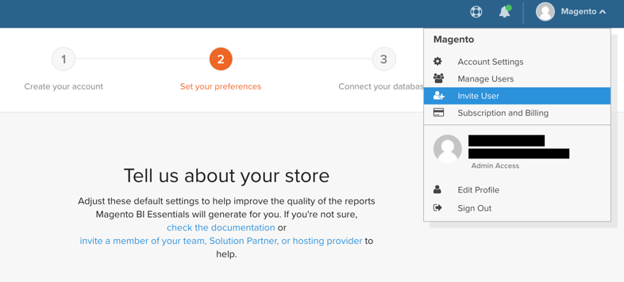

# Activar su [!DNL MBI] Cuenta para suscripciones locales

Para activar [!DNL MBI] para suscripciones on-premise, cree primero una [!DNL MBI] cuenta y, a continuación, conectar [!DNL MBI] a la base de datos de Commerce. Para obtener información sobre la activación en `Cloud Starter` proyectos, consulte [Activación de su [!DNL MBI] Cuenta para `Cloud Starter` Suscripciones](../getting-started/cloud-activation.md).

1. Cree su [!DNL MBI] Cuenta.

   - Vaya a su [Inicio de sesión de cuenta Adobe Commerce](https://account.magento.com/customer/account/login)

   - Ir a **[!UICONTROL My Account** > **My [!DNL MBI] Instances]**.

   - Clic **[!UICONTROL Create Instance]**. Si no ve este botón, póngase en contacto con el equipo de cuenta de Adobe o con el asesor técnico del cliente.

   - Escriba su información para crear su cuenta.

   

   - Vaya a la bandeja de entrada y verifique su dirección de correo electrónico. Si no ha recibido un correo electrónico, [soporte de contacto](https://experienceleague.adobe.com/docs/commerce-knowledge-base/kb/troubleshooting/miscellaneous/mbi-service-policies.html?lang=en).

   - Cree su contraseña.

   

   - Después de crear la cuenta, tiene la opción de agregar usuarios a la nueva cuenta. Ahora se pueden añadir administradores técnicos para llevar a cabo los siguientes pasos.

   

1. Introduce información sobre tu tienda para establecer tus preferencias.

   

1. Connect [!DNL MBI] a la base de datos de Commerce mediante una conexión cifrada.

   Commerce recomienda encarecidamente que se conecte mediante una [`SSH tunnel`](../data-analyst/importing-data/integrations/mysql-via-ssh-tunnel.md). Sin embargo, si esta no es una opción, aún puede vincular [!DNL MBI] a la base de datos mediante un [`direct connection`](../data-analyst/importing-data/integrations/mysql-via-a-direct-connection.md).

1. Después de conectarse correctamente [!DNL MBI] En la base de datos de Commerce, póngase en contacto con el equipo de cuenta de Adobe para coordinar los siguientes pasos, como la configuración de integraciones y otros pasos de configuración.

1. Cuando termine la configuración, puede hacer lo siguiente [iniciar sesión](../getting-started/sign-in.md) a su [!DNL MBI] cuenta.
