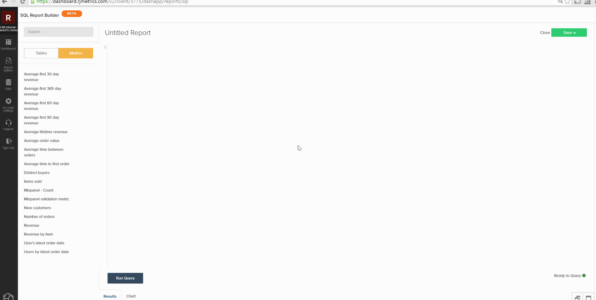
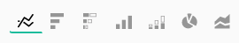

# Creación de visualizaciones a partir de consultas SQL

El objetivo de este tutorial es que se familiarice con la terminología usada en [!DNL SQL Report Builder] y proporcionarle una base sólida para crear `SQL visualizations`.

[[!DNL SQL Report Builder]](../data-analyst/dev-reports/sql-rpt-bldr.md) es un Report Builder con opciones: puede ejecutar una consulta con el único propósito de recuperar una tabla de datos o puede convertir esos resultados en un informe. Este tutorial explica cómo crear una visualización a partir de una consulta SQL.

## Terminología

Antes de comenzar este tutorial, consulte la siguiente terminología utilizada en `SQL Report Builder`.

- `Series`: La columna que desea medir se denomina Serie en SQL Report Builder. Los ejemplos más comunes son `revenue`, `items sold` y `marketing spend`. Se debe establecer al menos una columna como `Series` para crear una visualización.

- `Category`: la columna que desea usar para segmentar los datos se denomina `Category`. Es igual que la característica `Group By` de [`Visual Report Builder`](../data-user/reports/ess-rpt-build-visual.md). Por ejemplo, si desea segmentar los ingresos de duración de los clientes por su origen de adquisición, la columna que contiene el origen de adquisición se especificaría como `Category`. Se puede establecer más de una columna como `Category`.

>[!NOTE]
>
>Las fechas y marcas de tiempo también se pueden usar como `Categories`. Son simplemente otra columna de datos de la consulta y deben tener el formato y el orden que desee en la propia consulta.

- `Labels`: se aplican como etiquetas del eje x. Al analizar las tendencias de los datos a lo largo del tiempo, las columnas año y mes se especifican como etiquetas. Se puede configurar más de una columna para que sea Label.

## Paso 1: Escribir la consulta

Tenga en cuenta lo siguiente:

- [!DNL SQL Report Builder] usa [`Redshift SQL`](https://docs.aws.amazon.com/redshift/latest/dg/c_redshift-and-postgres-sql.html).

- Si está creando un informe con una serie temporal, asegúrese de `ORDER BY` las columnas de marca de tiempo. Esto garantiza que las marcas de tiempo se trazen en el orden correcto en el informe.

- La función `EXTRACT` es excelente de usar para analizar el día, la semana, el mes o el año de la marca de tiempo. Esto resulta útil cuando el `time interval` que desea usar en el informe es `daily`, `weekly`, `monthly` o `yearly`.

Para empezar, abra [!DNL SQL Report Builder] haciendo clic en **[!UICONTROL Report Builder** > **SQL Report Builder]**.

Por ejemplo, considere esta consulta que devuelve el número total mensual de artículos vendidos para cada producto:

```sql
    SELECT SUM("qty") AS "Items Sold", "products's name" AS "product name",
    EXTRACT(year from "Order date") AS "year",
    EXTRACT(month from "Order date") AS "month"
    FROM "items"
    WHERE "products's name" LIKE '%Jeans'
    GROUP BY  "products's name", "year","month"
    ORDER BY "year" ASC,"month" ASC
    LIMIT 3500
```

Esta consulta devuelve esta tabla de resultados:


## Paso 2: Crear la visualización

Con estos resultados, *¿cómo se crea la visualización?* Para comenzar, haga clic en la ficha **[!UICONTROL Chart]** en el panel `Results`. Esto muestra la ficha `Chart settings`.

Cuando se ejecuta una consulta por primera vez, el informe puede parecer inescrutable porque todas las columnas de la consulta se trazan como una serie:


Para este ejemplo, desea que sea un gráfico de líneas que siga la tendencia a lo largo del tiempo. Para crearlo, utilice esta configuración:

- `Series`: seleccione la columna `Items sold` como `Series`, ya que desea medirla. Después de definir una columna `Series`, verá una sola línea trazada en el informe.

- `Category`: en este ejemplo, desea ver cada producto como una línea diferente en el informe. Para ello, ha establecido `Product name` como `Category`.

- `Labels`: use las columnas `year` y `month` como etiquetas en el eje x para poder ver `Items Sold` como tendencias a lo largo del tiempo.

>[!NOTE]
>
>La consulta debe contener una cláusula `ORDER BY` en las etiquetas si son `date`/`time` columnas.

A continuación se muestra una breve descripción de cómo creó esta visualización, desde la ejecución de la consulta hasta la configuración del informe:



## Paso 3: Seleccionar un(a) `Chart Type`

Este ejemplo utiliza el tipo de gráfico `Line`. Para usar un(a) `chart type` diferente(a), haga clic en los iconos de la sección de opciones del gráfico para cambiarlo:



## Paso 4: Guardar la visualización

Si desea volver a utilizar este informe, asígnele un nombre y haga clic en **[!UICONTROL Save]** en la esquina superior derecha.

En el menú desplegable, seleccione `Chart` como `Type` y, a continuación, un tablero en el que guardar el informe.

## Ajuste

¿Quieres ir un paso más allá? Consulte las [prácticas recomendadas de optimización de consultas](../best-practices/optimizing-your-sql-queries.md).
