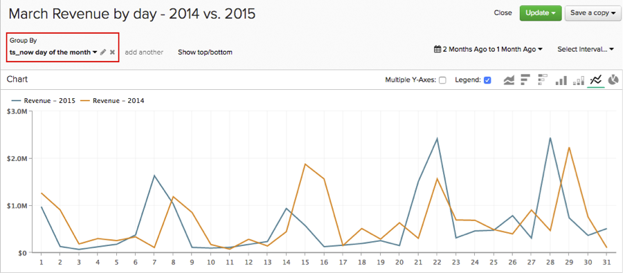

# Usar [!DNL Time] opciones en [!DNL Visual Report Builder]

Una de las características de [!DNL Visual Report Builder] es la configuración global de `Time Range` y `Interval`. Esta configuración le permite analizar los datos del informe durante un período de tiempo específico.

Sin embargo, en algunos análisis puede que sea necesario tener en cuenta intervalos de tiempo o intervalos de tiempo diferentes en el mismo informe. Ahí es donde entran `Time` opciones. Para darle una mejor idea de cómo usar las opciones de `Time` en sus informes, este tutorial cubre los siguientes casos de uso:

* [Análisis de métricas sin marcas de tiempo](#notimestamp)
* [Concesión de un intervalo de tiempo independiente a una métrica](#independenttimeinterval)
* [Comparación de la misma métrica en diferentes intervalos de tiempo](#difftimerange)

Si desea seguir algunos de los informes de ejemplo mencionados en este tema, abra [[!DNL Visual Report Builder]](../data-user/reports/ess-rpt-build-visual.md) antes de continuar.

## Análisis de métricas sin marcas de tiempo {#notimestamp}

Algunas métricas simplemente no pueden generar tendencias a lo largo del tiempo porque los datos no se recopilan ni almacenan con una marca de tiempo asociada. Por ejemplo, una tabla de inventario a menudo contiene solo una fila para cada SKU. En ese caso, debería [crear la métrica](../data-user/reports/ess-manage-data-metrics.md) sin especificar una marca de tiempo.

Al usar una métrica de este tipo en su informe, observa que al agregar esta métrica a un informe se establece automáticamente un(a) `Time Interval` independiente de `None` y `Time Range` de `Global`:

## Concesión de un intervalo de tiempo independiente a una métrica {#independenttimeinterval}

`Time` Las opciones le permiten crear gráficos basados en el tiempo del 100% para identificar qué día, semana, mes o año contribuyó con la mayor cantidad de valor durante un intervalo de tiempo específico. En esta sección, se crea un gráfico que muestra el porcentaje de ingresos generados en cada mes natural de un año.

Este tipo de informe puede resultar útil si desea comparar los ingresos generados año tras año. Por ejemplo, un gráfico para 2015 reveló que enero contribuyó con el 18 por ciento de los ingresos del año y un gráfico para 2016 mostró solo el 8 por ciento. Podrías empezar a investigar lo que podría haber pasado.

1. Agregue su métrica `Revenue` al informe.
1. Haga clic **[!UICONTROL Duplicate]** para hacer una copia de la métrica.
1. Haga clic en la opción global **[!UICONTROL Time Range]** y luego en **[!UICONTROL Moving Time Range]**. Establezca esto en `Last Year`.
1. Haga clic en la opción global **[!UICONTROL Time Interval]** y configúrela en `Monthly`.
1. Report Builder agrega automáticamente un segundo eje Y para una segunda métrica. Anule la selección del cuadro `Multiple Y-Axes`.
1. A continuación, aplique un(a) `Time Interval` independiente a la primera métrica. Haga clic en **[!UICONTROL Time Options]** (icono de reloj) a la derecha de `first Revenue metric`.
1. Haga clic en **[!UICONTROL Time Options]** en la ventana expandida que aparece sobre el informe.
1. En el menú desplegable, establezca lo siguiente:

   * `Time Interval`: establezca esto en `None`.

   * `Time Range`: establezca esto en `Last Year`; para ello, primero haga clic en **[!UICONTROL Custom]**, después en **[!UICONTROL Moving Range]** y, por último, seleccione la opción `Last Year`.

   * Haga clic en **[!UICONTROL Apply]** para guardar la configuración del intervalo y el intervalo. Esto crea una métrica que calcula los ingresos totales del año anterior. A continuación, utilice esta métrica como denominador en una fórmula.

   * Para ver el porcentaje de ingresos de cada mes, debe agregar una fórmula al informe. Haga clic en **[!UICONTROL Add Formula]**.

   * Escriba `B/A` en el campo de fórmula y seleccione `% Percent` en el menú desplegable situado junto al campo de texto. Esta fórmula divide la cantidad de ingresos de un mes específico del año pasado por la cantidad total de ingresos del año pasado.

   * Haga clic en **[!UICONTROL Apply Changes]**.

   * Oculte ambas métricas de entrada y cambie el nombre de la fórmula.

Ahora puede ver el impacto que tuvo cada mes el año pasado:

## Comparación de la misma métrica en diferentes intervalos de tiempo {#difftimerange}

Este ejemplo utiliza una dimensión personalizada denominada `Day number of the month`. Si deseas crear este informe y aún no tienes esta dimensión en tu Data Warehouse, [ponte en contacto con el soporte técnico](https://experienceleague.adobe.com/docs/commerce-knowledge-base/kb/troubleshooting/miscellaneous/mbi-service-policies.html) para obtener ayuda.

Los dos ejemplos más comunes en esta categoría son (1) la comparación de métricas de crecimiento (ingresos año tras año o mes tras mes) y (2) una mejor comprensión de las tendencias recientes de ventas de artículos o inventarios.

Para demostrar este caso de uso, observe los ingresos diarios del mes anterior en comparación con el mismo mes del año anterior. Supongamos que desea ver los ingresos de cada día de enero de 2016 y luego compararlos con los de enero de 2015, enero de 2014 y así sucesivamente. Este informe nos lo mostraría.

1. Agregue su métrica `Revenue` al informe.
1. Haga clic **[!UICONTROL Duplicate]** para hacer una copia de la métrica.
1. Cambie el nombre de la primera métrica a `Items sold last 7 days` y el de la segunda a `Items sold last 28 days`.
1. Haga clic en **[!UICONTROL Time Range]** y luego en **[!UICONTROL Moving Time Range]**. Establezca esto en `Last Month`.
1. Haga clic en **[!UICONTROL Time Interval]** y configúrelo en `None`.
1. Haga clic en **[!UICONTROL Time Options]** (icono de reloj) junto a la segunda métrica `Revenue`.
1. Haga clic en **[!UICONTROL Time Options]** en la ventana expandida que aparece sobre el informe.
1. En el menú desplegable, establezca lo siguiente:

   * `Time Interval`: establezca esto en `None`.

   * `Time Range`: establezca esto en `From 14 Months Ago To 13 Months Ago` al hacer clic primero en **[!UICONTROL Custom]** y luego en **[!UICONTROL Moving Range]**. Utilice los campos y los menús desplegables de la parte superior del menú para establecer el intervalo. Esta configuración nos permite ver los ingresos del mes anterior, pero del año anterior.

   No se preocupe si la métrica desaparece del informe: al establecer una opción de tiempo independiente, se oculta automáticamente la métrica del informe. Para volver a mostrarla, haga clic en **[!UICONTROL Show]** junto a la métrica.

   

   * Haga clic en **[!UICONTROL Apply]** para guardar la configuración del intervalo y el intervalo.

   * A continuación, agregue su dimensión personalizada `Day number of the month` haciendo clic en **[!UICONTROL Group By]** y seleccionando la dimensión. Devolverá el número de día del mes de un pedido; por ejemplo, un pedido realizado el 2 de marzo devolverá `2`.

   * En el menú desplegable `Group By`, seleccione `Show All` y haga clic en **[!UICONTROL Apply]**. Esto crea los valores del eje X para el informe:

   

   * Cambie el nombre de las métricas. En el ejemplo, la primera métrica es `Revenue - 2015` y la segunda es `Revenue - 2014`.

Otro uso común de `Time Options` personalizado es determinar semanas de suministro. Especialmente durante la temporada de vacaciones o durante un periodo promocional especial, es posible que desee tener en cuenta los artículos vendidos durante la última semana, el mes y el periodo promocional anterior para tomar decisiones de compra informadas.

Recuerde establecer los intervalos de tiempo según lo que necesite al crear este informe.

1. Agregue su métrica `Items Sold` al informe.
1. Haga clic **[!UICONTROL Duplicate]** para hacer una copia de la métrica.
1. Cambie el nombre de las métricas. Puede usar los mismos nombres o algo que sea similar:
   1. Cambie el nombre de la primera métrica a `Items sold last 7 days`.
   1. Cambie el nombre de la segunda métrica a `Items sold last 28 days`.
1. En la métrica `Items sold last 7 days`, haga clic en la opción **[!UICONTROL Time Range]** global y luego en **[!UICONTROL Moving Time Range]**. Para este ejemplo, lo estableció en `Last 7 Days`.
1. Haga clic en **[!UICONTROL Time Interval]** y configúrelo en `None`.
1. A continuación, defina `Time Options` para la métrica `Items sold last 28 days`. Haga clic en **[!UICONTROL Time Options]** (icono de reloj) a la derecha de la métrica `second Items sold`.
1. Haga clic en **[!UICONTROL Time Options]** en la ventana expandida que aparece sobre el informe.
1. En el menú desplegable, establezca lo siguiente:

   * `Time Interval`: establezca esto en `None`.
   * `Time Range`: establezca esto en `From 29 days to 1 day ago` al hacer clic primero en **[!UICONTROL Custom]** y luego en **[!UICONTROL Moving Range]**. Utilice los campos y los menús desplegables de la parte superior del menú para establecer el intervalo.
   * Haga clic en **[!UICONTROL Apply]** para guardar la configuración del intervalo y el intervalo.
   * Duplique la métrica `Items sold last 28 days` y abra la nueva métrica `Time Options`. Establezca las opciones en lo siguiente:

      * `Time Interval`: deje esto como `None`.
      * `Time Range`: cambie esto al intervalo de fechas que se ajuste a la promoción que le interesa haciendo clic en **[!UICONTROL Specific Date Range]** y luego ingresando las fechas apropiadas.
      * Cambie el nombre de la métrica `Items sold during last promotion` o similar.
      * Agregue su métrica `Units on hand`.
      * A continuación, debe agregar los cálculos que muestran las semanas disponibles, teniendo en cuenta las tendencias de ventas, para los períodos de tiempo (`last 7 days`, `last 28 days` y `last promo`) que incluye en el informe. Debe hacerlo una vez por cada período de tiempo.

Para crear las fórmulas, haga clic en **[!UICONTROL Add Formula]**. Escriba las fórmulas a continuación y haga clic en **[!UICONTROL Apply Changes]** cuando termine. Repita esto para cada uno de los tres períodos de tiempo:

* Para `last 7 days time period`, escriba `D / A` en el campo `Formula`.
* Para `last 28 days time period`, escriba `D / (B/4)` en el campo `Formula`.

  >[!NOTE]
  >
  >Es importante normalizar aquí los intervalos de tiempo seleccionados. En este ejemplo, divida 28 días en cuatro semanas. Es posible que tenga que aplicar una lógica diferente a la fórmula.

* Para `last promo period`, escriba `D / C` en el campo `Formula`.

  

* Por último, personalice el informe ocultando las métricas y agregando `SKU` o una dimensión similar al informe como `Group By`.

Este ejemplo demuestra que los niveles de inventario actuales estaban bien situados para una venta de todo un producto de 14 días. Sin embargo, añadir un periodo promocional comparable sugiere que la empresa necesita hacer algunos cambios, ya sea pidiendo más inventario y promocionando solo los artículos con suficientes unidades en stock.

Dado que los clientes se comportan de forma diferente a lo largo del tiempo, es probable que observe variaciones en los datos al realizar los análisis. La configuración de Opciones de tiempo personalizadas le permite crear rápidamente análisis complejos, lo que permite tomar decisiones basadas en datos que tienen en cuenta las tendencias históricas.

