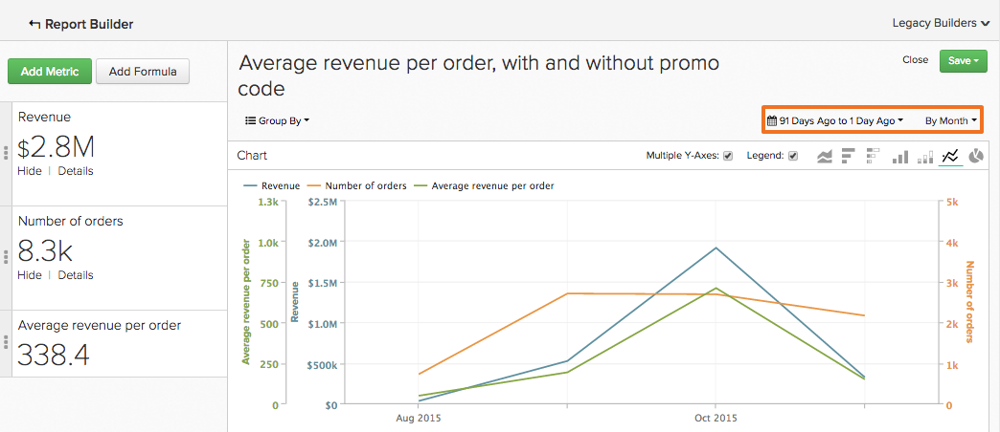
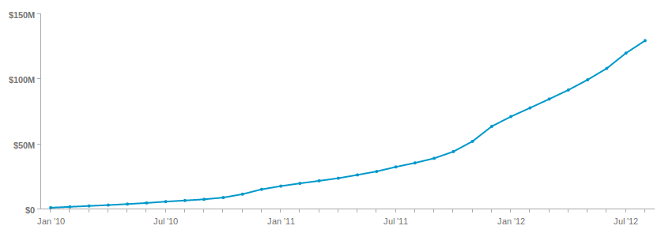
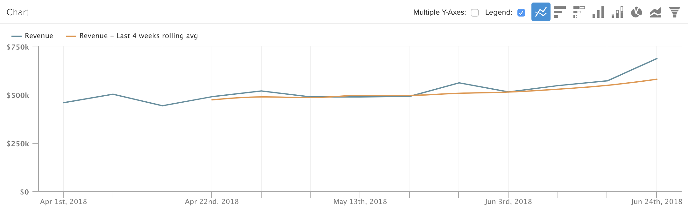

# Usar [!DNL Visual Report Builder]

[[!DNL Visual Report Builder]](../data-user/reports/ess-rpt-build-visual.md) le permite explorar visualmente sus datos para obtener información y ayudar a tomar decisiones comerciales. Este tutorial lo acompañará durante el proceso de creación de un informe básico.

>[!NOTE]
>
>Para agregar un informe a un panel, necesita `Standard` [permisos de usuario](../administrator/user-management/user-management.md) y `Edit` acceso al panel.

## Paso 1: Creación de un informe

Para empezar a crear un informe, haga clic en **[!UICONTROL Report Builder]** en la barra lateral o en **[!UICONTROL Add Report]** en la parte superior de cualquier panel. Cuando se muestre la página `Report Builder`, haga clic en la opción **[!UICONTROL Visual Report Builder]**.

Para editar un informe creado en [!DNL Visual Report Builder], haga clic en el icono de engranaje (Opciones) en la esquina superior derecha de cualquier gráfico y luego haga clic en **[!UICONTROL Edit]**.

## Paso 2: Añadir métricas

El primer paso para crear un análisis es seleccionar [la métrica](../data-user/reports/ess-manage-data-metrics.md) que se va a analizar. Aunque las métricas se enumeran alfabéticamente de forma predeterminada, también puede agruparlas por la tabla que alimenta la métrica.

Puede agregar métricas adicionales después de seleccionar la métrica inicial y superponer todas las métricas en un solo informe, o realizar cálculos de varias métricas agregando fórmulas.

## Paso 3: Agregar `Formulas`

`Formulas` se agregan a los informes al hacer clic en **[!UICONTROL Add Formula]**, que se encuentra justo encima de la lista de métricas del informe. En el [editor de fórmulas](../data-analyst/dev-reports/formulas-in-rpt-bldr.md), cualquiera de las métricas incluidas en el informe se puede usar como entradas. Los operadores matemáticos básicos se utilizan para manipular las distintas métricas.

Supongamos que desea crear un informe que muestre los ingresos medios por pedido. En este caso, dividiría la métrica `Revenue` por la métrica `Number of orders`.

## Paso 4: Configuración de `Time Period` y `Interval of Analysis` {#time}

Para centrarse en un periodo de tiempo determinado, se puede definir el periodo de tiempo del análisis. También puede elegir intervalos de tiempo para segmentar los datos (por ejemplo, por año, trimestre o mes). Utilice los menús de la esquina superior derecha del gráfico para establecer el período de tiempo y el intervalo.

Al establecer un intervalo de fechas específico para el período de tiempo, asegúrese de que la fecha de inicio sea al principio del intervalo y la fecha de finalización al final del intervalo.

Por ejemplo, si se establece un período de tiempo de `January 1st` a `March 1st` y se elige un intervalo de `monthly`, se muestra `March` como punto de datos, pero se omitirá todos los días en `March` excepto `March 1`. En ese caso, debe hacer su `Time Period` desde `January 1 to March 31`.

## Paso 5: `Group by` / `Segmenting the Analysis` {#groupby}

[Para segmentar las métricas por una dimensión de datos](../best-practices/segment-filter.md), haga clic en el menú **[!UICONTROL Group by]** en la parte superior izquierda del gráfico. Esto revela un menú desplegable que incluye todas las dimensiones disponibles de la primera métrica incluida en la lista.

Puede elegir `None` para evitar que una métrica se segmente. Por ejemplo, es posible que desee una métrica que devuelva los ingresos totales sin estar segmentada, mientras que otra métrica de ingresos esté segmentada por región.

Vuelva al ejemplo de ingresos promedio por pedido y establezca Agrupar por en el código de promoción. Esto muestra el promedio de ingresos por pedido para pedidos con y sin código de promoción.

Si las métricas incluidas en el análisis se crean en distintas tablas de datos, una ventana emergente le permite seleccionar la dimensión de datos coincidente en cada tabla. El objetivo aquí es encontrar dimensiones que compartan un tipo de valores para la segmentación:

## Paso 6: Configuración `Metric Filters`, `Perspective` y `Time Interval` {#metric-specific}

Para cada métrica agregada al análisis, puede agregar filtros, seleccionar la perspectiva de datos relevante y establecer las opciones de `time interval`. Para obtener acceso a estas características, haga clic en los iconos de funnel (`Filter`), ojo (`Perspective`) y reloj (`Time`) que se encuentran junto a las métricas incluidas en el informe.

### `Filters`

`Filters` limita el conjunto de datos incluido en el análisis. Los filtros son útiles, por ejemplo, para evaluar canales de adquisición individuales y eliminar periféricos.

Además de los menús desplegables y el cuadro de texto, también puede utilizar operadores de filtro especiales como `LIKE` o `IN` para crear filtros.

Se admite el uso de caracteres comodín (`%` o `_`) con instrucciones `LIKE`. El comodín `%` coincide con varios caracteres, mientras que `_` coincide con cualquier carácter individual. Por ejemplo:

- `affiliate's name Like B%` solo permite datos de clientes cuyo nombre comience por `B`.

- `affiliate's name Like _ake` solo permite datos de clientes cuyos nombres sean como `Jake`, `Rake` o `Bake`, pero no `Drake` o `Blake`.

Añadir varios filtros permite un control estricto de los datos del gráfico. De forma predeterminada, todas las condiciones de filtro deben ser verdaderas para que se incluya un fragmento de datos, pero puede crear relaciones O editando el cuadro de texto Reglas de filtro.

### `Perspectives`

`Perspectives` Le permite alternar fácilmente entre distintas vistas de sus datos. Observe lo que está disponible:

- `Standard perspective`: la perspectiva estándar muestra el resultado de la fecha coincidente en el eje x (por ejemplo, ingresos en enero). Esta es la perspectiva que utiliza en el ejemplo Ingresos promedio por pedidos.

- Perspectiva de `Amount` O `Percent Change` frente a `Previous Period`: esta perspectiva muestra la cantidad o el porcentaje de cambio de un intervalo a otro y es útil para medir la tasa de cambio en las métricas de cambio rápido. También existe una perspectiva para comparar el intervalo con el mismo período de tiempo del año pasado y mostrar el crecimiento interanual.

- `Cumulative perspective`: `cumulative perspective` muestra la suma acumulada o en curso de la métrica durante el período de tiempo. Esto se utiliza a menudo para analizar el total de clientes y planificar la capacidad futura.

- `Percent of First Value perspective`: esta perspectiva muestra los datos como un porcentaje del primer intervalo de tiempo incluido en el análisis. Esto resulta útil para medir la eficacia de acciones específicas en relación con el rendimiento del primer periodo.

- `Rolling averages window perspective`: la perspectiva de la ventana de promedios móviles muestra el valor promedio móvil de una métrica en el intervalo de tiempo especificado. El intervalo debe ser el mismo que el establecido en el nivel de informe. Por ejemplo, si el informe muestra el último trimestre completo de Ingresos por semana, puede establecer el intervalo de tiempo de la ventana promedio móvil en cuatro semanas. Esto hace que los tres primeros valores sean nulos y el cuarto valor representa el promedio de las primeras cuatro semanas de ingresos. Para mayor claridad, asegúrese de desactivar la casilla de verificación `Multiple Y-Axes` si está viendo la misma métrica con un promedio móvil, como en el ejemplo siguiente.

### Opciones de tiempo específicas de la métrica

Existen dos opciones para las métricas utilizadas en los informes: pueden generar tendencias en el tiempo según las opciones de tiempo globales o no, lo que las mostrará como un número escalar.

Si se cambia el intervalo de tiempo de una métrica a `None`, se devuelve un número `scalar`, lo que resulta útil al crear fórmulas que impliquen la división de una métrica de tendencias temporales por un número `scalar`. Además, también puede cambiar el intervalo de tiempo de la métrica `scalar` a un intervalo de tiempo independiente del del del informe.

Por ejemplo, supongamos que desea ver los ingresos mensuales de 2019 expresados como un porcentaje de los ingresos generales de 2019. Puede agregar dos métricas `Revenue` a un informe con un intervalo de tiempo global del 1 de enero de 2019 al 31 de diciembre de 2019, segmentado por intervalo mensual.

>[!NOTE]
>
>Si agrega `group by` dimensiones, elija una nueva visualización o ajuste el intervalo de tiempo y, a continuación, guarde solo el número (`scalar`). Estos ajustes no se conservarán la próxima vez que abra ese informe desde un panel, solo se conservará el intervalo de tiempo.

Para obtener más información sobre cómo usar las opciones de tiempo en los informes, consulte este [tutorial](../tutorials/time-options-visual-rpt-bldr.md).

## Paso 7: Guardar el informe

Cuando cree un gráfico, puede guardarlo si hace clic en **[!UICONTROL Save]** en la esquina superior derecha de `Visual Report Builder`.

Puede elegir guardar un gráfico, tabla o número (`scalar`) mediante la lista desplegable `Type` y el panel en el que se debe guardar el informe mediante la lista desplegable `Location`.

Luego puede guardar el informe haciendo clic en **[!UICONTROL Save to Dashboard]**.

## Salidas de informe

Para ayudarle a decidir qué resultado del informe elegir, consulte lo siguiente:

### Gráfico

### Tabla

### Número (`scalar`)

¡Felicidades! Ha terminado.
